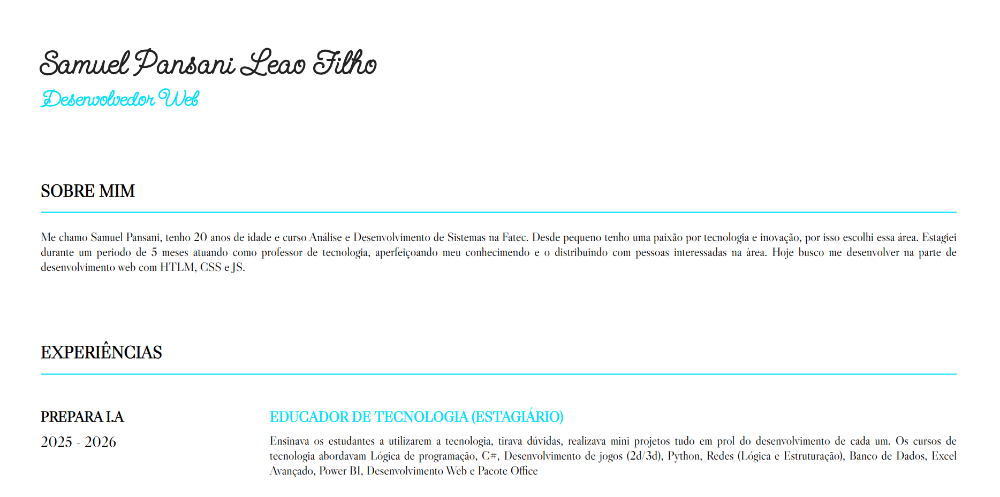

# 🌐 Currículo Online

Este é um projeto de currículo online desenvolvido com HTML e CSS, com o objetivo de apresentar minhas habilidades, experiências e formas de contato de maneira moderna e acessível.

🔗 **Acesse o projeto:**  
👉 https://github.com/Samuel-Pansani

---

## 📌 Sobre o projeto

Este currículo online foi criado para substituir o currículo tradicional em PDF, permitindo uma apresentação mais interativa e profissional.

Ele inclui:

- 📄 Seção de habilidades
- 📞 Informações de contato
- 🔗 Links para LinkedIn e GitHub
- 📱 Layout responsivo

---

## 🛠️ Tecnologias utilizadas

- HTML5
- CSS3
- Flexbox
- Responsividade

---

## 🎯 Objetivos do projeto

- Praticar estruturação semântica em HTML
- Aprimorar estilização com CSS
- Criar um layout limpo e profissional
- Desenvolver um projeto real para portfólio

---

## 📷 Preview

```md
